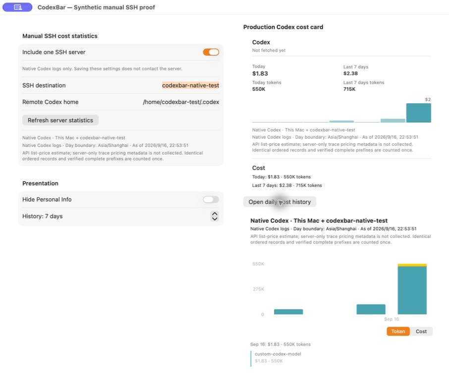
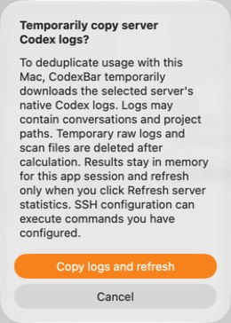
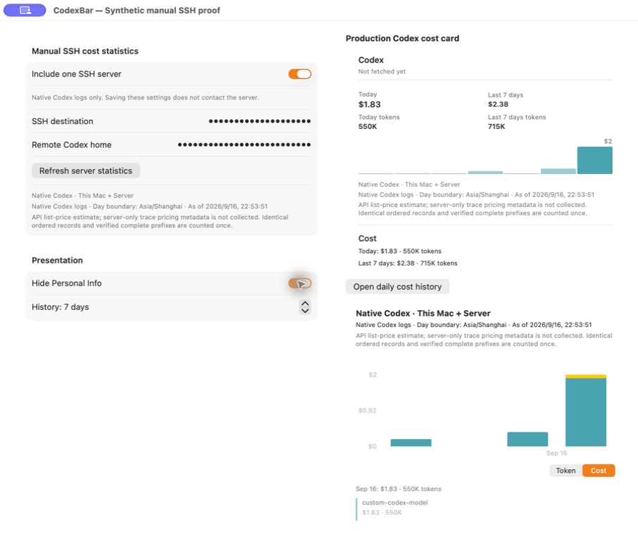
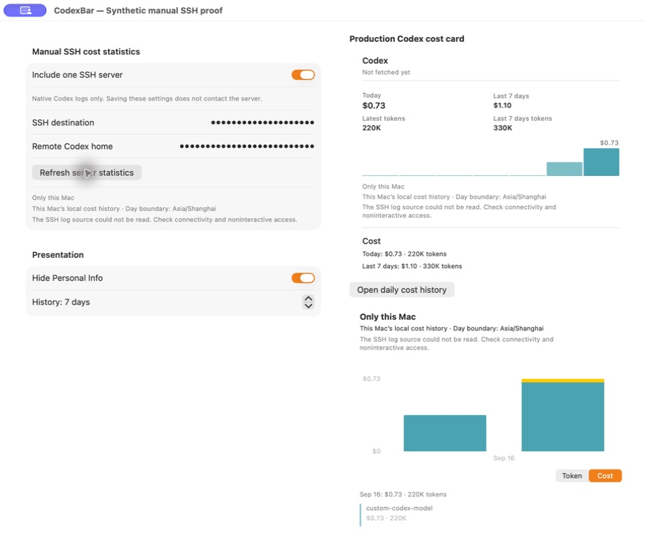
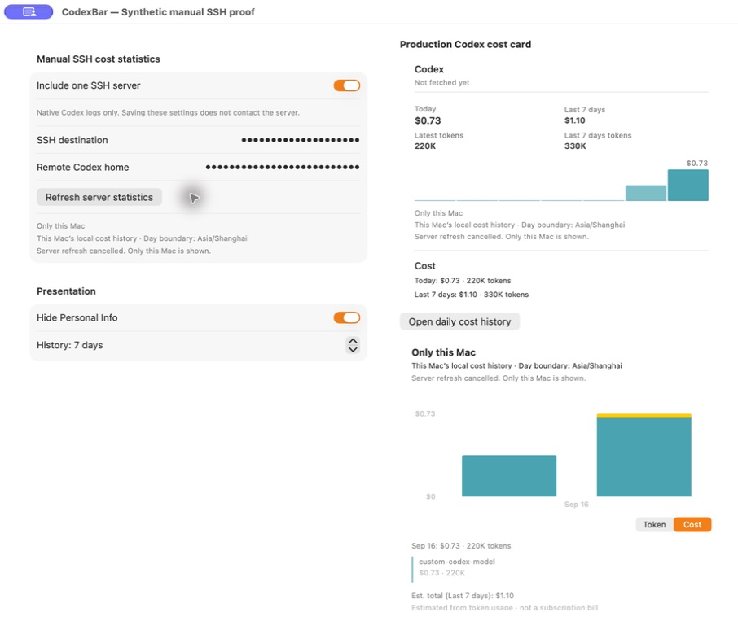

# Native SSH cost runtime evidence

Tested implementation: `8f1df3474591fd4f4838a6b618b80c00e3cace1d`.
This replaces the earlier CLI-only proof; the old CLI document is retained as historical context.
The accompanying [JSON receipt](codex-ssh-native-runtime.json) contains the exact values, timestamps, binary hashes,
13 recorded GUI steps and screenshot hashes. All displayed sessions, amounts, model names and server paths are synthetic.

## What was actually exercised

A fresh debug App displayed the production `CodexRemoteCostSettingsView`, `UsageMenuCardView` and
`CostHistoryChartMenuView` in a standalone native window. Actual clicks toggled the source, edited its home,
cancelled and accepted the first disclosure, refreshed, opened the chart, enabled Hide Personal Info, cancelled an
active transfer, disabled the feature and closed the window during another transfer. It used the production mirror,
packaged CLI guardian and combined scanner, with a dedicated SSH configuration selected by the debug isolation seam.
This is an isolated native-view acceptance run, not a claim that a real account's quota/login flow or the installed
menu-bar instance was exercised. The quota header says “Not fetched yet” because live account probes were disabled.

The client was macOS 27.0 arm64 / Swift 6.3.2. Its real SSH connection went through a remote Intel Mac to a disposable
Debian 12 x86_64 container. The server ran GNU rsync/find/stat/sha256sum; the collector did not invoke a remote
CodexBar CLI. A separate build directory in that same container validated the shared code using Swift 6.3.3. All 2,617 regular
source files in the Linux test directory matched the SHA-256 manifest of the tested Git archive.

## Nonzero accounting oracle

The local session has two token-count records. The remote copy has the identical complete record prefix plus a
third token-count record, and a second archived session contributes a remote-only date. The fixture uses `custom-codex-model` with frozen rates of
$3 input, $0.30 cached input and $12 output per million tokens. Cached input is part of input, not added a second time.

| Scope | Today tokens | Today USD | 7-day tokens | 7-day USD |
| --- | ---: | ---: | ---: | ---: |
| Local baseline | 220,000 | 0.732 | 330,000 | 1.098 |
| Canonical local + remote union | 550,000 | 1.830 | 715,000 | 2.379 |

The observed union was **715,000 / $2.379**, not the naïve **1,045,000 / $3.477** sum. September 13 appears only in the
remote history, with 55,000 tokens / $0.183. The card and both chart modes expose that same snapshot; the combined
snapshot contains zero project/session drill-down rows. The UI rounds monetary display to cents.

## Observed lifecycle

The counter below counts explicit refresh transactions, not individual SSH connections.

| Action | Refresh transactions | Result |
| --- | ---: | --- |
| Start disabled; enable and edit home | 0 | Local baseline unchanged |
| Cancel the first raw-log disclosure | 0 | No consent and no transfer |
| Accept disclosure and refresh | 1 | Exact combined oracle; temporary directory empty before display |
| Hide Personal Info | 1 | Host/home masked in fields and accessibility text; amounts unchanged |
| Change the same alias's endpoint, preserving inode/size/mtime | 1 | Old combined result invalidated; no automatic refresh |
| Manually refresh unreachable endpoint | 2 | Sanitized error; exact local baseline retained; temporary directory empty |
| Restore endpoint and manually refresh | 3 | Same combined oracle recovered |
| Start a 64 MiB synthetic transfer, then Cancel | 4 | Active private data observed, then local fallback and empty temporary directory |
| Disable, re-enable, start another transfer, close window | 5 | Normal exit awaited cleanup; no task App remained and temporary directory was empty |

During the two interrupted transfers, recorded temporary sizes were 37,847,782 and 36,766,438 bytes. All observed
request directories were `0700` and files `0600`. The synthetic local JSONL, its ordinary local SQLite ledger, pricing
file and live SQLite sidecar bytes remained unchanged throughout remote transactions. On shutdown, the database
and JSONL hashes still matched the baseline; SQLite may remove its normal sidecars when closing.

## Isolation boundary

The final run used dictionary-backed defaults, synthetic homes/cache paths, disabled account startup, a process-wide
proof language override, an independent test bundle identifier and no embedded widget. Its `CodexSyntheticProofOnly`
marker was tested by launching with neither proof arguments nor an isolated environment: it returned the fixed
rejection message and exited before AppKit. The normal distributed bundle does not set that test marker.

An earlier exploratory run exposed a harness hazard: after closing the proof window, UI observation briefly
re-launched the unmarked debug copy through ordinary startup. That task copy was stopped; the installed App was
not stopped or overwritten. Ordinary configuration access during that earlier launch cannot be ruled out. That run
is not used as the final isolation proof. The marker and independent identity were then added, and all GUI steps
above were repeated on the protected final artifact.

## Automated verification

| Check | Actual result |
| --- | --- |
| Focused affected Mac suites | 178 tests / 13 suites passed |
| Independent final UI/proof review | 43 tests / 6 suites passed; source review passed |
| `make check` | Passed; 0 SwiftLint violations across 2,332 files |
| `make test` | Passed: 107/107 groups on the first attempt; summaries report 11,147 tests, 0 failures/retries/timeouts |
| Linux `swift build --product CodexBarCLI --jobs 1` | Passed on Swift 6.3.3, Debian 12 x86_64 |
| Linux `swift test --jobs 1 --no-parallel` | 555 tests / 76 suites passed |
| Actual Linux CLI `--help` / `--version` | Both exited 0 |
| `git diff --check` | Passed |

The repository’s normal opt-in live/provider checks were not enabled.

The focused regression coverage includes identity aliases, exact-copy/prefix accounting, independent equal-token
sessions, old directories with new records, cross-root ancestry, root-order/cold/warm scans, frozen model/custom
prices, retained missing/retargeted local inputs, unknown prices, invalid timestamps and oversized state records.
Transport tests exercise manifest/path validation, actual rsync permissions, incomplete/changing transfers, disk
and file limits, cleanup retry, cancellation, deadlines and caller-exit ownership. The small monitored disk-growth
test observed a 12,288-byte threshold stop at 14,336 bytes; it demonstrates a monitored cutoff with overshoot,
not a hard disk quota. A Linux fixture setup race was repaired by a bounded SQLite busy timeout and mandatory
successful priority-row setup/readback before asserting fallback; production accounting was unchanged.

Independent Core review covered scanner/data-integrity source and existing logs. Its additional lifecycle execution
review did not run after an automated safety check blocked that channel. Lifecycle execution evidence comes from
the implementer's repository tests and the coordinator's real GUI/SSH run, not an independent third-party runtime audit.

The task container, its image, remote scratch directory and generated local SSH configuration/key directory were
removed after testing. The original SSH configuration was not edited; the other two running containers were unchanged.

## Limits

This evidence does not establish invoice parity, every fork/export shape, native Intel macOS GUI behavior, Linux
ARM/musl release builds, live-account authentication, arbitrary dynamic SSH resolution or a production deployment.
Known unsupported or incomplete histories deliberately fall back to local data. The 512 MiB limit is a monitored
received-data threshold; temporary SQLite work is additional. The collection deadline initiates termination, while
uninterruptible kernel I/O can extend safe draining with the activity lock retained. Cleanup is not secure erasure
and is not immediate after a forced process exit. See [the user guide](../../docs/codex-ssh-costs.md).
