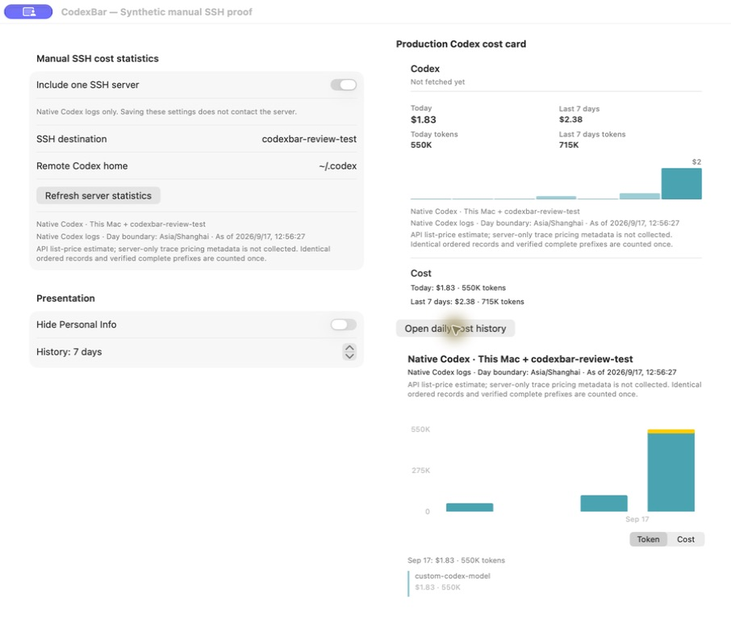
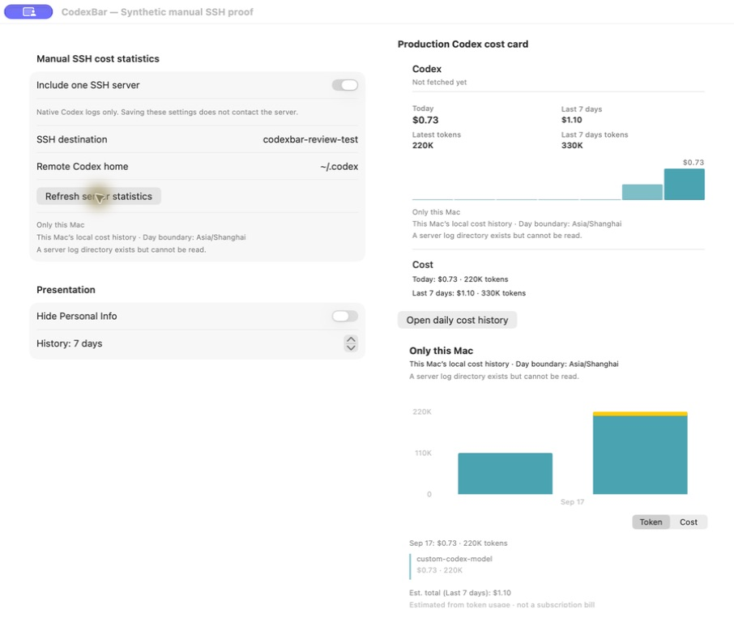

# SSH review fixes and upstream conflict resolution

Tested implementation: `76a3ee2dcff972cc79ae56d608ca0debcfdbc3f5`.
Merged upstream through `7e3c7be1`; a separate merge-tree check against the subsequent `1a57ef11` also completed without conflicts.
[Machine-readable receipt](codex-ssh-review-fixes.json).

## Review comments addressed

- [Main-actor fingerprinting](https://github.com/steipete/CodexBar/pull/3687#discussion_r4028482684): pricing/configuration reads and local-home symlink resolution now run in a detached worker. Repeated presentation lookups share one read and reuse its result for up to five seconds. A pending expired check temporarily shows local data; unchanged verification restores the retained combined result and notifies observers. Host/home/scope/day/window changes revoke the old input immediately. Explicit refresh owns fresh checks before collection and before publication, and cancellation awaits pending context work.
- [Nested manifest exit statuses](https://github.com/steipete/CodexBar/pull/3687#discussion_r4028482679): manifest records stream on a separate descriptor while a bounded control pipe retains the first fixed validation code. The outer `find` failure no longer overwrites every nested error with `46`. No remote temporary files, raw stderr parsing or new dependencies were added.

The six reported conflicts were resolved in `CHANGELOG.md`, `MenuCardView+Costs.swift`, `CodexParserHash.generated.swift`, `CostUsageStore.swift`, `CostUsageStoreTests.swift`, and `ProviderArchitectureGatekeeperTests.swift`. Upstream incomplete-cost presentation and Claude cache invalidation were retained alongside the SSH scope and private-store behavior. Native Codex predecessor adoption is covered by the existing retained-history tests. Exact architecture anchors were updated without weakening the scanner or its tolerances.

## Actual verification

| Check | Result |
| --- | --- |
| Focused affected suites | 198 tests / 12 suites passed |
| `make check` | Passed; 0 SwiftLint violations across 2,348 files |
| Full Mac `make test` | 108/108 groups passed on the first attempt; summaries report 11,236 tests; 0 failures, retries or timeouts |
| Linux Swift 6.3.3 CLI build | Passed, Debian 12 x86_64, `--jobs 1` |
| Linux full tests | 559 tests / 78 suites passed |
| Linux CLI `--help` and `--version` | Both exited 0 |
| Linux source verification | All 2,635 regular input files matched the tested Git archive |

Context-cache regressions verify that 500 pending render lookups start one off-actor reader, 500 fresh cached lookups start no additional reader, the main actor remains responsive, unchanged revalidation notifies observers, late results cannot install another input's context, publication waits for a fresh post-scan check, and cancelled preflight never starts the SSH loader.

The exact generated manifest shell was run as the unprivileged test user against nine synthetic Linux scenarios:

| Condition | Before | After |
| --- | ---: | ---: |
| Unreadable nested directory or file | 46 | 43 |
| Unsafe filename or symlink | 46 | 44 |
| Oversized JSONL / multiple failed batches | 46 | 45 |
| Actual file growth / unclassified find failure | 46 | 46 |
| Stable valid tree | 0 + END | 0 + END |

Every failing manifest omitted `END`, and Swift tests exercised the production typed-error mapping and rejection of partial transfers.

## Fresh native App and real SSH follow-up

The protected, independently identified debug proof bundle used synthetic histories and the production views, mirror, guardian, and scanner. The client was an Apple Silicon Mac; SSH reached a Debian container through the user's remote Intel Mac. The installed App and live-account probes were not used.

The local baseline remained **330,000 tokens / $1.098** over seven days. Manual refresh produced **715,000 / $2.379**, with Today **550,000 / $1.83**, including the remote-only date and counted-once shared prefix:

Changing the synthetic alias configuration while preserving inode, size and modification time revoked the combined result without a new SSH refresh. A real nested directory permission failure then reached the UI as **“A server log directory exists but cannot be read.”**, retaining the local totals instead of asking users to retry changing logs:

Restoring the synthetic directory's permissions and explicitly refreshing recovered the same combined totals. Seven recorded GUI states confirm empty temporary directories after operations and unchanged synthetic local JSONL/database hashes. The proof bundle rejected unisolated launches and exited normally after the run. Earlier proof details and their disclosed isolation incident remain in the [original native acceptance record](codex-ssh-native-runtime.md).

The dedicated test container, image, remote scratch directory and generated SSH key/configuration directory were removed. The three other running containers were unchanged.

The Core merge received an independent source check. The remaining follow-up implementation and regression checks were completed by the coordinator after delegated review capacity became unavailable; this document does not claim a completed independent review of every follow-up change. Repository opt-in live-account tests were not enabled. Maintainer approval of workflow execution and of the feature/privacy scope remains separate from these results.
