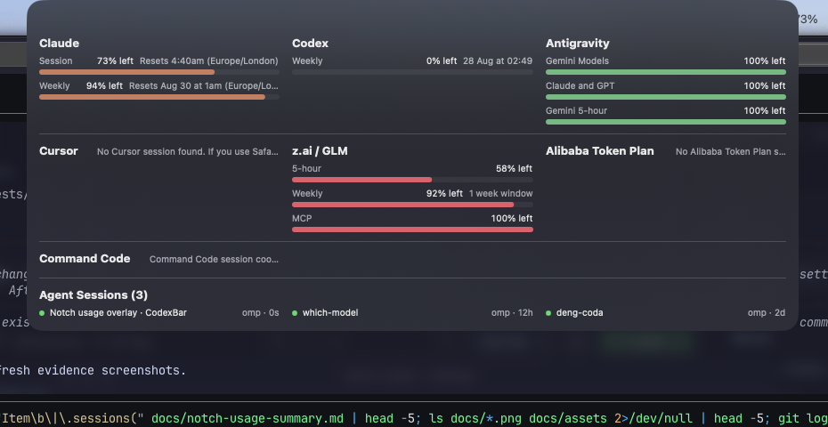
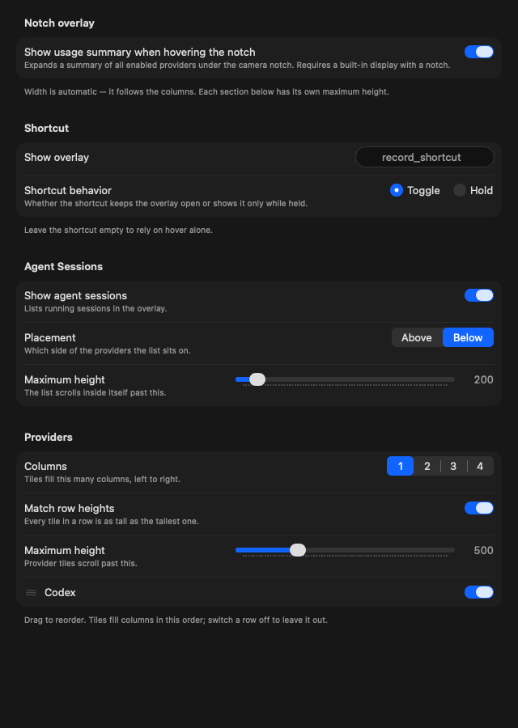

# Notch usage summary

Opt-in overlay that expands a usage dashboard under the camera notch of a built-in display.
Everything is configured in its own settings page: **Settings → Notch**.

## Settings
- `notchUsageSummaryEnabled` — off by default; no panel exists until it is on.
- `notchColumnCount` (1–4, default 1) — how many columns the tiles flow into. Width is never
  configured; the panel measures its own content.
- `notchMatchesRowHeights` (default on) — off, each column packs independently, so a short tile
  sits directly under a tall one. On, every tile in a grid row is as tall as that row's tallest.
- `notchProvidersMaxHeight` (100–1600, default 500) — ceiling for the provider grid; tiles past it
  scroll while the session band stays put.
- `notchSessionsMaxHeight` (100–1600, default 200) — ceiling for the session band; a longer list
  scrolls inside the band.
- `notchItemOrder` — provider instance IDs in display order. Keys absent from the list keep their
  natural position, so a newly enabled provider appears without the user re-sorting anything.
- `notchHiddenProviders` — providers are **opt-out**: a newly enabled provider joins the overlay
  without the user revisiting the pane.
- `notchShowsAgentSessions` — shows the agent-session list; requires Agent Sessions (Menu pane).
  The overlay reads `StatusItemController`'s `AgentSessionsStore` rather than running a second
  scanner, wired in `AppDelegate.ensureStatusController()`.
- `notchSessionsPlacement` (`above`/`below`, default `below`) — which side of the grid the band sits
  on. The list is always a full-width band with its own height budget, never a tile in the grid, so
  it takes no slot in `notchItemOrder`.
- `KeyboardShortcuts_showNotchOverlay` + `notchHotkeyMode` — optional shortcut and whether it
  toggles or only shows while held.

## Layout
- Tiles fill the grid in list order, left to right then down: item `i` sits at column
  `i % columnCount`, row `i / columnCount`. `columns()` and `rows()` slice that one placement two
  ways — `columns()` feeds the packed layout, `rows()` feeds the matched-height `Grid`, so both
  modes put the same tile in the same cell and only row heights differ.
- `NotchUsageOverlayContent` renders tiles at their natural size, each capped at
  `maximumTileWidth` (320pt) so one long provider message cannot stretch the whole panel.
- The two sections are budgeted independently. The band sits outside the grid's scroll view, so the
  session list is always visible: the grid scrolls at `notchProvidersMaxHeight`, and the band
  scrolls inside itself at `notchSessionsMaxHeight`.
- Each section reports the height its content wants from *inside* its own scroll view
  (`NotchGridHeightKey`, `NotchBandHeightKey`), where nothing clamps it, and
  `NotchUsageOverlayController.expandedFrame` sums those two reports — each capped by its own
  ceiling — plus the stack's spacing and padding. Measuring a separate copy instead drifts from what
  SwiftUI lays out, which showed up as content stuck behind a scroll no matter how high the ceiling
  was raised. The total is still bounded by 90% of the screen height and the screen width less a
  margin.
- The frame is re-measured while the panel is open: `applyExpandedFrame` wraps the measurement in
  `withObservationTracking`, so a snapshot landing after the panel opened resizes it. Without that
  the panel keeps its opening size and late-arriving bars are stuck behind a scroll.
- The panel's hosting view sets `sizingOptions = []`. Without it the hosting view installs its
  content's ideal size as window constraints and a long provider list grows the panel off-screen.

## Hover and hotkey
- One borderless, non-activating `NSPanel` at `.statusBar` level lives for as long as the feature is
  enabled and a notched screen exists. It never becomes key or main.
- Hover is detected by an `NSTrackingArea` (`.activeAlways`, `.inVisibleRect`,
  `.mouseEnteredAndExited`) on the hosting view — no global event monitor, so no Accessibility
  permission.
- `mouseEntered` → 0.35s dwell → expand. `mouseExited` → 0.4s grace (cancelled by re-entry) →
  collapse, then restore the collapsed frame after the animation.
- `NotchHotkeyState` is the pure decision table for the shortcut: toggle flips on each press and
  survives key release; hold expands on press and collapses on release unless the pointer is inside,
  in which case hover takes over. While the shortcut holds the panel, losing the pointer cannot
  collapse it.
- `NotchUsageOverlayController` observes the setting and
  `NSApplication.didChangeScreenParametersNotification`; turning the setting off or losing the
  notched screen tears the panel down without a relaunch.

## Bars
`NotchUsageOverlayModel.make(store:settings:agentSessions:)` walks
`UsageStore.enabledProvidersForDisplay()`, which already includes enabled user-plugin instances, and
renders at most four bars per provider:

1. `snapshot.primary` — provider's session label.
2. `snapshot.secondary` — provider's weekly label.
3. `snapshot.tertiary` — provider's tertiary label, only when the window exists.
4. First `extraRateWindows` entry with `usageKnown`; otherwise `providerCost` against its limit;
   otherwise, for Codex only, the monthly credit limit from `UsageStore.credits`.

Labels come from `ProviderDescriptorRegistry.descriptor(for:).presentation.rateWindowLabels(...)`, so
provider-owned wording matches the menu. Plugins use the generic primary/secondary/tertiary labels.
Bars honor the “Usage bars fill” (`usageBarsShowUsed`) preference and clamp usage to 0–100. Reset
text that merely repeats the lane title is suppressed. A provider with no renderable bar keeps its
row and shows its error, or “No usage fetched yet”.

See also: `docs/providers.md`.
