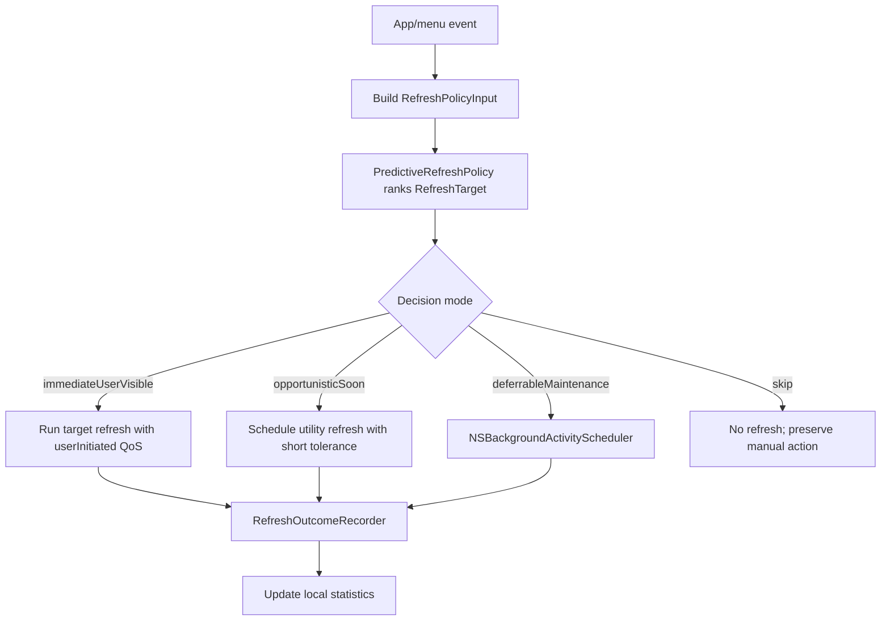

# Predictive Refresh Policy RFC

**Status:** Draft design<br>
**Scope:** Local scheduling policy for provider/account refreshes, menu prewarming, and refresh telemetry<br>
**Non-goal:** This document does not propose changing provider fetch semantics, auth flows, or UI rendering paths.

## Motivation

CodexBar currently exposes a fixed refresh cadence through `RefreshFrequency` (`manual`, `1m`, `2m`, `5m`,
`15m`, `30m`). That model is simple and predictable, but it treats all providers, accounts, workspaces, and visible
surfaces the same:

- a provider the user opens every few minutes and a provider they rarely inspect get the same background cadence;
- the active account, inactive accounts shown in a stacked menu, and account switcher entries are treated as if they had
  the same user value;
- Codex accounts are richer than generic token accounts: the user often chooses a specific source/workspace, not only an
  email address;
- refreshes can occur when the app is not about to be used, spending CPU/network budget without improving perceived
  freshness;
- menu-open paths sometimes discover stale data at the exact moment the user is looking at the menu;
- error-prone providers can keep retrying at a cadence that is too optimistic for the current environment.

The proposed direction is to split refresh behavior into two layers:

1. `PredictiveRefreshPolicy`: a local, explainable policy that predicts whether a target is worth refreshing or
   prewarming soon.
2. `SystemRefreshScheduler`: a macOS-aware executor that maps policy decisions onto system scheduling primitives such
   as QoS classes, timer tolerance, and `NSBackgroundActivityScheduler`.

The policy should make CodexBar feel fresher when the user is likely to look at it, while reducing invisible refresh
work when the app is idle, on battery, thermally constrained, or repeatedly failing.

## Design Principles

- **Local only.** Interaction history, outcomes, and learned weights stay on device.
- **Explainable before clever.** Start with EWMA/Bayesian TTLs before contextual bandits or heavier models.
- **Never block the hot path.** Prediction may influence refresh deadlines; it must not run expensive work on menu
  tracking, SwiftUI body recomputation, or status item drawing paths.
- **Respect macOS energy contracts.** System APIs decide when deferrable work actually runs. The model only supplies
  urgency and confidence.
- **Provider-aware but provider-siloed.** A provider's failures, latency, identity, and usage volatility must not leak
  into another provider's rendered state.
- **Account-aware without silent account switching.** Prediction may prewarm or refresh likely account targets, but it
  must not change the user's selected provider, token account, Codex visible account, or system account.
- **Bounded behavior.** Every automated decision has minimum intervals, retry backoff, and a user-visible manual refresh
  escape hatch.

## User-Visible Switch Surface

The scheduler should be designed around the state the user can actually see and switch, not around a single global
provider timer.

### Provider and overview selection

`ProviderSwitcherSelection` exposes two high-level targets:

- `overview`, which renders a bounded set of selected provider rows in the merged menu;
- `provider(UsageProvider)`, which renders one provider's detailed card and actions.

The provider switcher can also show a weekly remaining quota indicator. That makes provider selection both an intent
signal and a freshness signal: a provider with low remaining quota may deserve a fresher snapshot if the user is likely
to inspect it soon.

### Generic token accounts

Providers in `TokenAccountSupportCatalog` can expose multiple `ProviderTokenAccount` values. The user-visible fields are:

- `label` / `displayName`;
- active index;
- optional `externalIdentifier`;
- optional `usageScope`;
- optional `organizationID`;
- optional `workspaceID`;
- per-account snapshot presence, error, and `sourceLabel` when stacked account cards are rendered.

The account token itself is secret material. It is a credential input, never a ranking feature or telemetry field.

Generic token accounts are switched by `setActiveTokenAccountIndex`. The menu path immediately activates a cached
snapshot for the selected account and then performs a user-initiated target refresh. Prediction can improve perceived
switch latency by keeping likely account snapshots warm.

### Codex visible accounts

Codex has a richer account surface. A `CodexVisibleAccount` contains:

- `email`;
- `workspaceLabel`;
- `workspaceAccountID`;
- `authFingerprint`;
- optional `storedAccountID`;
- `selectionSource`;
- `isActive`;
- `isLive`;
- `canReauthenticate`;
- `canRemove`.

`CodexActiveSource` currently distinguishes:

- `liveSystem`;
- `managedAccount(id)`;
- `profileHome(path)`.

This means the selected Codex target is not just an account. It is a source-backed account/workspace projection. The
policy should preserve that distinction so a managed account, profile-home account, and live system account with similar
emails are not accidentally collapsed into one scheduling bucket.

Codex also has settings actions that matter for policy safety:

- active account selection;
- system account selection or promotion;
- re-authentication;
- account removal;
- unreadable managed account store state.

These actions should become guardrail features. A target that is missing auth can be displayed and ranked, but should
not receive the same automatic refresh treatment as a healthy target.

### Multi-account layout

`MultiAccountMenuLayout` changes the cost model:

- `segmented`: render a switcher; prioritize the active account and likely next account;
- `stacked`: render multiple account cards; fetch or hydrate a bounded set of account snapshots.

This setting is a scheduling feature. Stacked layout justifies broader prewarming because the user will see multiple
account cards at once. Segmented layout should stay narrower unless local interaction history predicts an imminent
account switch.

## Normalized Refresh Targets

Provider-only policy is too small for CodexBar's current UI. The policy should rank normalized targets built from the
visible switch surface.

```swift
struct RefreshTarget: Sendable, Hashable {
    enum Kind: Sendable, Hashable {
        case overview
        case provider
        case tokenAccount
        case codexVisibleAccount
        case codexSource
        case workspace
        case dataLane
    }

    let kind: Kind
    let provider: UsageProvider
    let accountKey: AccountKey?
    let source: SourceKind?
    let workspaceKey: WorkspaceKey?
    let usageScope: String?
    let lane: RefreshLane
    let surface: PresentationSurface
}

struct AccountKey: Sendable, Hashable {
    let stableID: String
    let displayLabelHash: String?
}

struct WorkspaceKey: Sendable, Hashable {
    let stableID: String?
    let displayLabelHash: String?
}

enum TargetHealth: Sendable, Hashable {
    case ok
    case needsReauth
    case workspaceDeactivated
    case missingAuth
    case unavailable
}

enum SourceKind: Sendable, Hashable {
    case liveSystem
    case managedAccount
    case profileHome
    case tokenEnvironment
    case tokenCookie
    case oauth
    case adminAPI
    case localCLI
    case browserCookie
    case unknown
}

enum RefreshLane: Sendable, Hashable {
    case usageSnapshot
    case credits
    case tokenCost
    case accountProjection
    case organizations
    case menuPrewarm
}

enum PresentationSurface: Sendable, Hashable {
    case menuBarIcon
    case providerSwitcher
    case accountSwitcher
    case stackedCard
    case settings
}
```

Two adapters can create these targets without forcing Codex and generic token accounts into the same model:

- `TokenAccountSwitchTargetAdapter`: maps `ProviderTokenAccount`, `TokenAccountSupport`, active index, layout, cached
  snapshots, errors, and source labels.
- `CodexVisibleAccountSwitchTargetAdapter`: maps `CodexVisibleAccount`, `CodexActiveSource`, account health, workspace
  grouping, layout, cached snapshots, errors, and source labels.

The common scheduler can then decide what to refresh or prewarm, while provider-specific adapters preserve identity and
credential semantics.

## Existing Deterministic Ranking Baseline

CodexBar already has a useful hand-written ranking baseline in `CodexAccountPresentationOrdering`:

1. active Codex account;
2. healthy accounts with positive availability;
3. healthy accounts with exhausted availability;
4. failed accounts;
5. missing-auth accounts;
6. availability descending, then display name, then original index.

Accounts are also grouped by workspace key (`workspaceAccountID`, workspace label, or personal). Any learned ranker or
LM-assisted ranker should first beat this deterministic baseline in offline replay. Until then, the deterministic
ordering should remain the source of truth for visible ordering, and prediction should only influence prewarming,
scoped refresh priority, and tie-break suggestions behind a debug flag.

## Relevant macOS Primitives

Apple provides scheduler building blocks, not a user-behavior prediction API:

- [`NSBackgroundActivityScheduler`](https://developer.apple.com/documentation/foundation/nsbackgroundactivityscheduler)
  schedules deferrable maintenance/background work and lets the system choose an efficient execution time.
- Apple's Energy Efficiency Guide recommends `NSBackgroundActivityScheduler` for periodic content fetches and
  deferrable tasks with intervals of about 10 minutes or more, because the system can account for energy usage, thermal
  conditions, and CPU use.
- QoS classes let CodexBar classify work as user-interactive, user-initiated, utility, or background. Apple notes that
  QoS affects scheduling, CPU/I/O throughput, and timer latency.
- Timer tolerance should be used for any remaining timers so the system can coalesce wakeups.
- `ProcessInfo` exposes low power and thermal state signals that should make predictive refresh more conservative.

The practical architecture is:

```text
local policy decides: refresh now? soon? defer? skip?
macOS scheduler decides: exact execution time and resource priority
```

## Proposed Components

### `PredictiveRefreshPolicy`

Pure decision logic. It receives target-local state and returns a decision; it does not perform network requests.

```swift
struct RefreshPolicyInput: Sendable {
    let target: RefreshTarget
    let provider: UsageProvider
    let now: Date
    let userVisibleTrigger: RefreshTrigger?
    let timeSinceLastMenuOpen: TimeInterval?
    let timeSinceLastProviderSelection: TimeInterval?
    let timeSinceLastSuccessfulRefresh: TimeInterval?
    let lastRefreshLatency: TimeInterval?
    let lastRefreshFailed: Bool
    let staleAge: TimeInterval?
    let quotaNearLimit: Bool
    let providerVisibleInOverview: Bool
    let accountVisibleInSwitcher: Bool
    let accountVisibleAsStackedCard: Bool
    let accountHealth: TargetHealth
    let sourceLabel: String?
    let userCanSelectTarget: Bool
    let userCanRepairTarget: Bool
    let canPrewarmTarget: Bool
    let thermalState: ProcessInfo.ThermalState
    let lowPowerModeEnabled: Bool
}

struct RefreshDecision: Sendable {
    enum Mode: Sendable {
        case immediateUserVisible
        case opportunisticSoon
        case deferrableMaintenance
        case skip
    }

    let mode: Mode
    let earliestStart: Date
    let tolerance: TimeInterval
    let qos: QualityOfService
    let reason: String
}
```

Initial scoring can be intentionally small:

```text
score =
  staleness_weight * normalized_stale_age
+ visibility_weight * provider_visible_in_overview
+ recency_weight * recent_menu_open_probability
+ quota_weight * quota_near_limit
+ account_weight * likely_account_or_workspace_switch
- health_penalty * missing_auth_or_reauth_required
- failure_penalty * recent_failure_count
- energy_penalty * low_power_or_thermal_pressure
```

The score maps to a mode:

- high score + user-visible trigger -> `immediateUserVisible`
- high score without a visible trigger -> `opportunisticSoon`
- medium score -> `deferrableMaintenance`
- low score -> `skip`

### `SystemRefreshScheduler`

Owns timers/background scheduler instances and dispatches work at the priority chosen by the policy.

Responsibilities:

- run visible refreshes with `.userInitiated` when the user asks or opens stale provider details;
- run likely-soon refreshes with `.utility` and a short tolerance;
- run maintenance refreshes through `NSBackgroundActivityScheduler` when intervals are long enough;
- avoid launching refreshes while menu tracking is actively scrolling or rebuilding rich menu content;
- enforce provider/account-level minimum intervals and retry backoff.

It should be the only layer that knows about concrete scheduling APIs.

### `RefreshOutcomeRecorder`

Records small, privacy-preserving local outcomes that improve future decisions and make behavior debuggable.

Candidate fields:

- provider id
- target kind
- hashed account/workspace key, when present
- trigger type
- decision mode and reason code
- started/finished timestamps
- latency bucket
- success/failure class
- whether the result changed visible data
- whether a user opened the menu shortly after the refresh

Do not record:

- tokens, API keys, cookies, auth headers, raw response bodies;
- account email, organization names, workspace names, or raw profile-home paths;
- prompt or model conversation content.

Use `OSLog` for short diagnostic events and a compact local state file for learned statistics. Logs should use stable
reason codes, not verbose provider payloads.

## Learning Strategy

### Phase 1: Deterministic Adaptive TTL

Start without ML:

- maintain EWMA refresh latency per target, with provider-level aggregates as fallback;
- maintain EWMA change rate per target (`refresh result changed visible state`);
- extend TTL when a target repeatedly returns unchanged data;
- shorten TTL when a target is frequently opened, near quota limits, or changing quickly;
- back off aggressively after failures.

This phase is easy to reason about and should be implemented first.

### Phase 2: Local Menu-Open Probability

Estimate `P(menu opens in next N seconds)` from local history:

- hour-of-day buckets;
- recent menu-open intervals;
- provider selection recency;
- account switcher selection recency;
- Codex workspace/source selection recency;
- whether CodexBar was opened immediately after previous background refreshes.

This can be a logistic score or even a calibrated table. The goal is not prediction purity; it is to avoid refreshing
just after the user needed fresh data.

### Phase 3: Contextual Bandit

If Phase 1/2 show useful signal, consider a tiny contextual bandit for target refresh modes:

- arms: `skip`, `defer`, `opportunistic`, `refresh`;
- reward: fresh data when viewed minus CPU/network/error cost;
- constraints: minimum provider/account interval, max refreshes/hour, failure backoff, low-power cap.

Keep this opt-in or hidden behind a debug flag until replay tests show consistent benefit.

### LM/ranker boundary

A small learned ranker can be useful for target ordering, but it should not own correctness. The hard policy kernel
should still enforce:

- no automatic active provider/account/system-account changes;
- no refresh of targets that would trigger credential prompts or unsafe auth flows;
- no raw account email, workspace name, token, cookie, or prompt content in telemetry;
- deterministic fallback when there is not enough local history.

If an LM-style ranker is ever considered, use it only as an offline or shadow-mode scorer for natural-language-like
signals such as provider names, workspace labels, or source labels. The live product should consume bounded numeric
scores and reason codes, not generated recommendations.

## Menu Prewarming

Predictive refresh should not only fetch provider data. It can also prewarm cheap menu state:

- precompute provider menu descriptors when store data changes;
- precompute likely next provider submenu model after an overview selection;
- prewarm likely next token account snapshots for segmented account switchers;
- hydrate Codex visible account snapshots for likely workspace/source switches;
- keep stacked account card data fresh when the layout means multiple cards are visible at once;
- avoid rebuilding or measuring rich rows while AppKit is in menu tracking;
- invalidate prewarmed content when provider snapshots, account selection, Codex source selection, workspace grouping,
  locale, or settings change.

This is separate from rendering fixes. The policy may decide that prewarming is useful; the UI layer still needs to
keep heavy SwiftUI recomputation out of scroll/highlight paths.

## Runtime Flow



## Validation Plan

### Offline replay

Before changing live refresh behavior, add a replay harness that feeds recorded, sanitized event sequences into the
policy and compares:

- refresh count per hour;
- visible stale opens;
- stale account switches;
- stale stacked-card rows;
- mean and p95 visible refresh latency;
- failure retry count;
- account/workspace targets skipped because of missing auth or repair-required state;
- skipped refreshes that would have changed visible data.

### Local runtime telemetry

Use bounded `Logger` events:

- `refresh_policy_decision`
- `refresh_scheduled`
- `refresh_started`
- `refresh_finished`
- `refresh_skipped`

Each log should include public reason codes and numeric buckets only.

### User-facing checks

- Manual refresh remains immediate.
- Fixed `RefreshFrequency` values still work when adaptive mode is disabled.
- Low power mode and serious/critical thermal states reduce opportunistic work.
- Provider failures trigger backoff and do not spam keychain/browser prompts.

## Rollout Plan

1. Land this RFC.
2. Add target adapters that project provider, token-account, and Codex visible-account UI state into `RefreshTarget`
   values, with no behavior change.
3. Add `RefreshOutcomeRecorder` behind debug logging, with no behavior change.
4. Add deterministic `PredictiveRefreshPolicy` and replay tests.
5. Add `SystemRefreshScheduler` integration for maintenance refreshes only.
6. Add an experimental setting for adaptive refresh.
7. Evaluate whether contextual bandits or learned rankers beat deterministic TTL and `CodexAccountPresentationOrdering`
   in replay before enabling them.

## Open Questions

- Should adaptive refresh be a new mode in `RefreshFrequency`, or an advanced toggle layered over existing cadences?
- What is the minimum acceptable replay corpus before changing defaults?
- Should provider-storage scans share the same scheduler or keep their current separate throttle?
- What freshness metric matters most: provider snapshot age, quota-window age, or "result changed visible UI"?
- Should account/workspace switch prediction influence visible ordering, or only prewarming and refresh priority?
- Should Codex `profileHome(path)` targets be grouped with managed accounts when they resolve to the same runtime
  identity, or kept separate because the source path is operationally meaningful?
- How much local history should be retained, and where should it live relative to existing settings/cache files?
