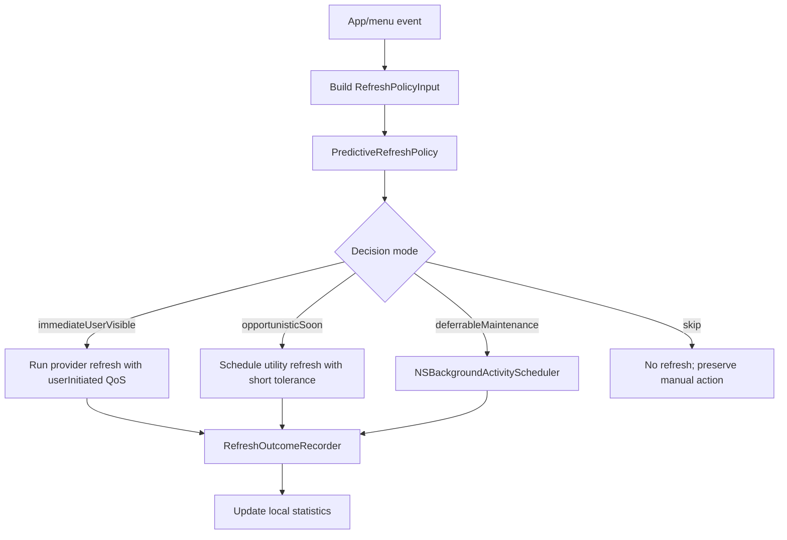

# Predictive Refresh Policy RFC

**Status:** Draft design  
**Scope:** Local scheduling policy for provider refreshes, menu prewarming, and refresh telemetry  
**Non-goal:** This document does not propose changing provider fetch semantics, auth flows, or UI rendering paths.

## Motivation

CodexBar currently exposes a fixed refresh cadence through `RefreshFrequency` (`manual`, `1m`, `2m`, `5m`,
`15m`, `30m`). That model is simple and predictable, but it treats all providers and all user sessions the same:

- a provider the user opens every few minutes and a provider they rarely inspect get the same background cadence;
- refreshes can occur when the app is not about to be used, spending CPU/network budget without improving perceived
  freshness;
- menu-open paths sometimes discover stale data at the exact moment the user is looking at the menu;
- error-prone providers can keep retrying at a cadence that is too optimistic for the current environment.

The proposed direction is to split refresh behavior into two layers:

1. `PredictiveRefreshPolicy`: a local, explainable policy that predicts whether a provider is worth refreshing or
   prewarming soon.
2. `SystemRefreshScheduler`: a macOS-aware executor that maps policy decisions onto system scheduling primitives such
   as QoS classes, timer tolerance, and `NSBackgroundActivityScheduler`.

The policy should make CodexBar feel fresher when the user is likely to look at it, while reducing invisible refresh
work when the app is idle, on battery, thermally constrained, or repeatedly failing.

## Design Principles

- **Local only.** Interaction history, outcomes, and learned weights stay on device.
- **Explainable before clever.** Start with EWMA/Bayesian TTLs before contextual bandits or heavier models.
- **Never block the hot path.** Prediction may influence refresh deadlines; it must not run expensive work on menu
  tracking, SwiftUI body recomputation, or status item drawing paths.
- **Respect macOS energy contracts.** System APIs decide when deferrable work actually runs. The model only supplies
  urgency and confidence.
- **Provider-aware but provider-siloed.** A provider's failures, latency, identity, and usage volatility must not leak
  into another provider's rendered state.
- **Bounded behavior.** Every automated decision has minimum intervals, retry backoff, and a user-visible manual refresh
  escape hatch.

## Relevant macOS Primitives

Apple provides scheduler building blocks, not a user-behavior prediction API:

- [`NSBackgroundActivityScheduler`](https://developer.apple.com/documentation/foundation/nsbackgroundactivityscheduler)
  schedules deferrable maintenance/background work and lets the system choose an efficient execution time.
- Apple's Energy Efficiency Guide recommends `NSBackgroundActivityScheduler` for periodic content fetches and
  deferrable tasks with intervals of about 10 minutes or more, because the system can account for energy usage, thermal
  conditions, and CPU use.
- QoS classes let CodexBar classify work as user-interactive, user-initiated, utility, or background. Apple notes that
  QoS affects scheduling, CPU/I/O throughput, and timer latency.
- Timer tolerance should be used for any remaining timers so the system can coalesce wakeups.
- `ProcessInfo` exposes low power and thermal state signals that should make predictive refresh more conservative.

The practical architecture is:

```text
local policy decides: refresh now? soon? defer? skip?
macOS scheduler decides: exact execution time and resource priority
```

## Proposed Components

### `PredictiveRefreshPolicy`

Pure decision logic. It receives provider-local state and returns a decision; it does not perform network requests.

```swift
struct RefreshPolicyInput: Sendable {
    let provider: UsageProvider
    let now: Date
    let userVisibleTrigger: RefreshTrigger?
    let timeSinceLastMenuOpen: TimeInterval?
    let timeSinceLastProviderSelection: TimeInterval?
    let timeSinceLastSuccessfulRefresh: TimeInterval?
    let lastRefreshLatency: TimeInterval?
    let lastRefreshFailed: Bool
    let staleAge: TimeInterval?
    let quotaNearLimit: Bool
    let providerVisibleInOverview: Bool
    let thermalState: ProcessInfo.ThermalState
    let lowPowerModeEnabled: Bool
}

struct RefreshDecision: Sendable {
    enum Mode: Sendable {
        case immediateUserVisible
        case opportunisticSoon
        case deferrableMaintenance
        case skip
    }

    let mode: Mode
    let earliestStart: Date
    let tolerance: TimeInterval
    let qos: QualityOfService
    let reason: String
}
```

Initial scoring can be intentionally small:

```text
score =
  staleness_weight * normalized_stale_age
+ visibility_weight * provider_visible_in_overview
+ recency_weight * recent_menu_open_probability
+ quota_weight * quota_near_limit
- failure_penalty * recent_failure_count
- energy_penalty * low_power_or_thermal_pressure
```

The score maps to a mode:

- high score + user-visible trigger -> `immediateUserVisible`
- high score without a visible trigger -> `opportunisticSoon`
- medium score -> `deferrableMaintenance`
- low score -> `skip`

### `SystemRefreshScheduler`

Owns timers/background scheduler instances and dispatches work at the priority chosen by the policy.

Responsibilities:

- run visible refreshes with `.userInitiated` when the user asks or opens stale provider details;
- run likely-soon refreshes with `.utility` and a short tolerance;
- run maintenance refreshes through `NSBackgroundActivityScheduler` when intervals are long enough;
- avoid launching refreshes while menu tracking is actively scrolling or rebuilding rich menu content;
- enforce provider-level minimum intervals and retry backoff.

It should be the only layer that knows about concrete scheduling APIs.

### `RefreshOutcomeRecorder`

Records small, privacy-preserving local outcomes that improve future decisions and make behavior debuggable.

Candidate fields:

- provider id
- trigger type
- decision mode and reason code
- started/finished timestamps
- latency bucket
- success/failure class
- whether the result changed visible data
- whether a user opened the menu shortly after the refresh

Do not record:

- tokens, API keys, cookies, auth headers, raw response bodies;
- account email or organization names;
- prompt or model conversation content.

Use `OSLog` for short diagnostic events and a compact local state file for learned statistics. Logs should use stable
reason codes, not verbose provider payloads.

## Learning Strategy

### Phase 1: Deterministic Adaptive TTL

Start without ML:

- maintain EWMA refresh latency per provider;
- maintain EWMA change rate per provider (`refresh result changed visible state`);
- extend TTL when a provider repeatedly returns unchanged data;
- shorten TTL when a provider is frequently opened, near quota limits, or changing quickly;
- back off aggressively after failures.

This phase is easy to reason about and should be implemented first.

### Phase 2: Local Menu-Open Probability

Estimate `P(menu opens in next N seconds)` from local history:

- hour-of-day buckets;
- recent menu-open intervals;
- provider selection recency;
- whether CodexBar was opened immediately after previous background refreshes.

This can be a logistic score or even a calibrated table. The goal is not prediction purity; it is to avoid refreshing
just after the user needed fresh data.

### Phase 3: Contextual Bandit

If Phase 1/2 show useful signal, consider a tiny contextual bandit for provider refresh modes:

- arms: `skip`, `defer`, `opportunistic`, `refresh`;
- reward: fresh data when viewed minus CPU/network/error cost;
- constraints: minimum provider interval, max refreshes/hour, failure backoff, low-power cap.

Keep this opt-in or hidden behind a debug flag until replay tests show consistent benefit.

## Menu Prewarming

Predictive refresh should not only fetch provider data. It can also prewarm cheap menu state:

- precompute provider menu descriptors when store data changes;
- precompute likely next provider submenu model after an overview selection;
- avoid rebuilding or measuring rich rows while AppKit is in menu tracking;
- invalidate prewarmed content when provider snapshots, account selection, locale, or settings change.

This is separate from rendering fixes. The policy may decide that prewarming is useful; the UI layer still needs to
keep heavy SwiftUI recomputation out of scroll/highlight paths.

## Runtime Flow



## Validation Plan

### Offline replay

Before changing live refresh behavior, add a replay harness that feeds recorded, sanitized event sequences into the
policy and compares:

- refresh count per hour;
- visible stale opens;
- mean and p95 visible refresh latency;
- failure retry count;
- skipped refreshes that would have changed visible data.

### Local runtime telemetry

Use bounded `Logger` events:

- `refresh_policy_decision`
- `refresh_scheduled`
- `refresh_started`
- `refresh_finished`
- `refresh_skipped`

Each log should include public reason codes and numeric buckets only.

### User-facing checks

- Manual refresh remains immediate.
- Fixed `RefreshFrequency` values still work when adaptive mode is disabled.
- Low power mode and serious/critical thermal states reduce opportunistic work.
- Provider failures trigger backoff and do not spam keychain/browser prompts.

## Rollout Plan

1. Land this RFC.
2. Add `RefreshOutcomeRecorder` behind debug logging, with no behavior change.
3. Add deterministic `PredictiveRefreshPolicy` and replay tests.
4. Add `SystemRefreshScheduler` integration for maintenance refreshes only.
5. Add an experimental setting for adaptive refresh.
6. Evaluate whether contextual bandits beat deterministic TTL in replay before enabling them.

## Open Questions

- Should adaptive refresh be a new mode in `RefreshFrequency`, or an advanced toggle layered over existing cadences?
- What is the minimum acceptable replay corpus before changing defaults?
- Should provider-storage scans share the same scheduler or keep their current separate throttle?
- What freshness metric matters most: provider snapshot age, quota-window age, or "result changed visible UI"?
- How much local history should be retained, and where should it live relative to existing settings/cache files?

