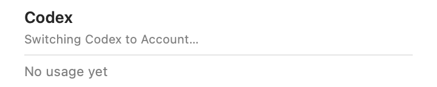
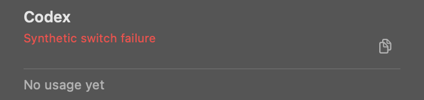
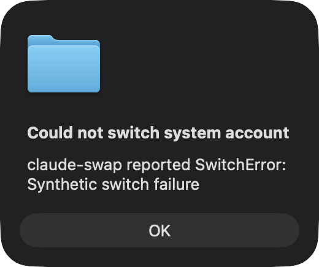

# System Account switch feedback proof

The privacy regression starts a switch with Hide Personal Info off, enables it before completion, and checks the
production card builder and controller notice. Both assertions failed with the captured fictional email before
the fix and pass with the current privacy setting applied. Additional coverage checks a removed account and a
notification result retained after the menu closes.

`SystemAccountSwitchFeedbackNativeProofTests` renders the production Codex account card with its live refresh
monitor attached. OCR checks loading, success, and failure feedback in light and dark appearances. Enabling
privacy after starting the switch removes the fictional email from the rendered card. The synthetic account is
absent from the current projection, so the private label falls back to `Account`.





The alert proof starts a Claude switch through the production controller with a failing stub executable. It
injects notification delivery failure, leaves alert presentation unmodified, captures the real modal NSAlert
after its opening animation, and checks its visible title and error text with OCR.



This proves native fallback presentation after **simulated delivery failure**. It does not prove macOS notification
authorization, successful notification delivery, or actual denied-permission handling. The application suppresses
notification delivery under tests. No real accounts, credentials, provider transport, or notification settings
are used or changed. The test host's generic icon is expected.

Reproduce with an output directory outside the home directory:

```sh
env CODEXBAR_TEST_CODEX_FILE_ISOLATION=1 \
  CODEXBAR_TEST_SESSION_FILE_ISOLATION=1 \
  CODEXBAR_SUPPRESS_TEST_KEYCHAIN_ACCESS=1 \
  CODEXBAR_SYSTEM_SWITCH_PROOF_DIR=/private/tmp/codexbar-system-feedback-proof \
  swift test --filter SystemAccountSwitchFeedbackNativeProofTests
```

The alert capture needs a desktop session with Screen Recording permission. The proof is opt-in and skips in
ordinary test runs. Full OCR output and subtitle values are in
[codex-feedback.json](system-account-switch-feedback/codex-feedback.json).
