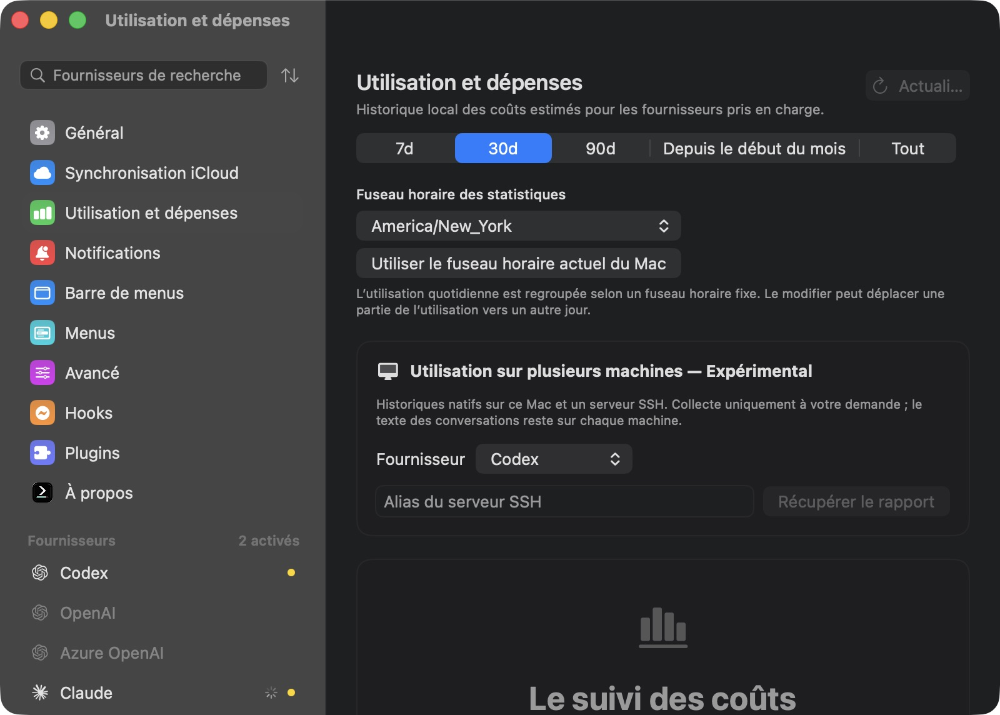

# Experimental cross-host native usage ledger

This experiment combines native Codex or Claude Code usage recorded on this machine and one explicitly
selected SSH host. It exports numeric usage records with hashed identities, deduplicates them before
summing, and shows uncertainty when the available histories cannot establish complete accounting.
It does not provide account-wide telemetry or a billing receipt. Deleted histories, unsupported formats,
unmetered requests and machines outside the selected pair remain outside the result.

## Manual use

```sh
codexbar cost --provider codex --combine-remote build-host --format json
codexbar cost --provider claude --combine-remote build-host
codexbar cost --provider claude --ledger-only --format json --days 30
```

The native app exposes the same manual operation in **Usage & Spend → Cross-host usage — Experimental**.
Choose Codex or Claude Code, enter a trusted SSH alias and select **Fetch report**. Changing the provider,
host or reporting timezone clears the result. Cancellation and leaving the view cancel the operation;
a late completion cannot publish over a newer request. Reports are retained only in memory. There is no
periodic SSH discovery or collection, and the existing local dashboard totals are unchanged.

Debug builds accept `--usage-ledger-preview` to open this settings pane at launch for native UI review.



The remote machine must have this experimental CLI installed as `codexbar` on its login-shell PATH.
The macOS app-bundle helper is a fallback when no PATH executable exists. Finding an older executable
that lacks `--ledger-only` is a source failure; it does not trigger another scan or a fallback total.
SSH runs with batch authentication, strict known-host checking, no terminal, no forwarded agent and no
port forwarding. A failed source remains visible while the other source's recorded subtotal is retained.

## Reporting window

Ledger modes accept one explicit `--provider codex|claude`. `--days` ranges from 1 to 365 and defaults to 30.
`--ledger-only` requires JSON output. `--combine-remote` supports text or JSON and is mutually exclusive
with `--ledger-only`. Neither mode accepts `--remote`, `--summary-only`, `--period`, `--group-by` or
`--breakdown`. Pi and OMP histories are excluded by construction.

The collecting machine fixes one timezone and inclusive window end before scanning either machine.
`--ledger-time-zone` accepts a timezone identifier, and `--ledger-end` accepts Unix milliseconds.
The start is midnight at the beginning of the first requested calendar day; the default end is the
collector's current time. Both explicit window boundaries travel as integer milliseconds so ISO8601
formatting of the snapshot date cannot truncate them. Remote reports must match the requested day count,
timezone, start and end. Records outside that interval are excluded.

## Versioned numeric transport

The schema version is **1**. A ledger contains:

| Field | Meaning |
| --- | --- |
| `schemaVersion`, `provider` | Transport compatibility and native provider |
| `updatedAt` | Snapshot timestamp |
| `historyDays`, `bucketTimeZone` | Requested calendar window |
| `windowStartUnixMs`, `windowEndUnixMs` | Inclusive integer-millisecond interval |
| `coverageIsEstablished` | Whether the source can establish coverage for that interval |
| `incompleteRequestCount`, `warnings` | Explicit source limitations |
| `records` | Native usage records; no daily total is invented into a request |

Each record carries a SHA-256 identity hash, an optional hashed session identity, an identity-evidence
class, an integer-millisecond timestamp, sanitized model identifiers, native token categories, a native
total and optional cost/pricing provenance. Codex input includes cache reads; Claude input excludes
cache reads and cache creation. The native total preserves those provider-specific definitions.
Reasoning tokens and one-hour cache creation are retained where recorded.

Prompts, responses, project paths, conversation titles and raw session/request/message identifiers are
not transferred. Identity components use length framing before hashing, and the export redacts model
metadata that is not an identifier. Hashes remain stable enough to correlate copies across the selected
machines; they are pseudonymous identifiers, not a claim of anonymization.

Validation rejects unsupported schemas/providers, mismatched windows, invalid numeric values, overflow
and malformed identity hashes. Each ledger is bounded to 100,000 records and 32 MiB of encoded output.
The SSH operation has a 180-second timeout. Codex scanning uses a disposable local cache removed after
the scan. The feature writes no persistent report cache or configuration, and never copies raw histories
to the collecting machine.

## Conservative accounting

Stable request identities are unioned before summing. Equal identities with equal native usage count
once. Different token, model or reasoning observations under the same identity are conflicts: the
conflicting identity is excluded and the result is partial. Different price/provenance observations
retain unique token accounting but make the combined dollar amount unavailable. Unknown prices do the
same; a partial known-price sum is not presented as the total price.

Legacy event identities are weaker evidence. The result reports their count and cannot establish full
cross-host coverage while they remain. When a session has different request/legacy representations
and no proven alias, its ambiguous legacy rows are withheld even if both representations came from
copied files on the same machine. If any strong request record lacks session provenance, all legacy
rows are withheld because the available metadata cannot disprove an overlap. Records without stable
identity are also withheld. This can undercount rather than invent certainty about an overlap.

Complete coverage requires readable source reports, established native scan coverage, no excluded
incomplete requests, no usage conflicts, no unidentified or ambiguously represented records and no
remaining legacy identities. Otherwise the app and CLI label the result a **recorded subtotal** and
show relevant source limitations. A clean scan describes the available native histories; it cannot prove
that a user never deleted or moved an earlier history.

Costs preserve authoritative dollar values recorded by the native reader where available and otherwise
use that reader's API-price estimate, including cache/priority metadata. Prices can differ between
machines with different catalogs or custom overlays. These amounts do not establish subscription spend
or the provider's invoiced charge.

## Experiment and review scope

This is an opt-in design proposal, not an automatic replacement for local spend accounting. Validation
must cover copied/resumed histories, forks and unavailable fork parents, streaming response updates,
request versus legacy representations, contradictory token or price observations, missing metadata,
millisecond window roundtrips, source failures, privacy and cancellation. CLI/parser tests establish
accounting behavior; a separate rendered-app check establishes the manual native interaction.
