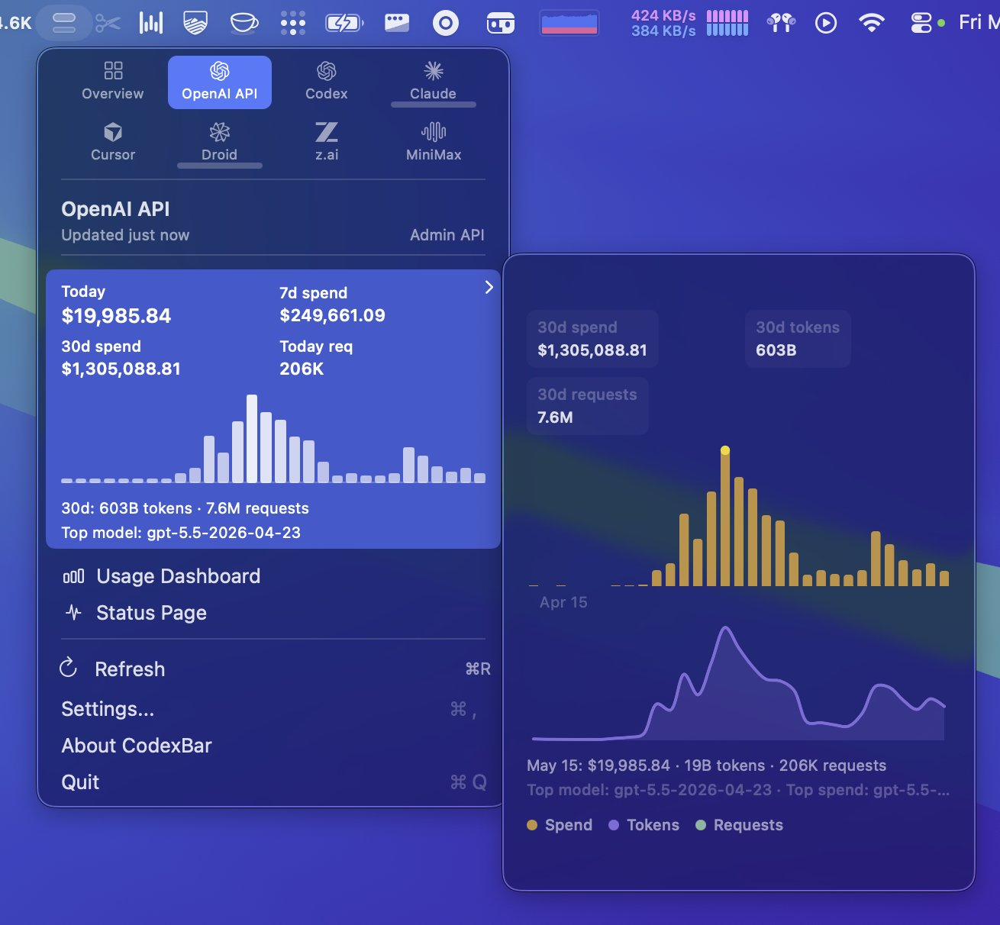
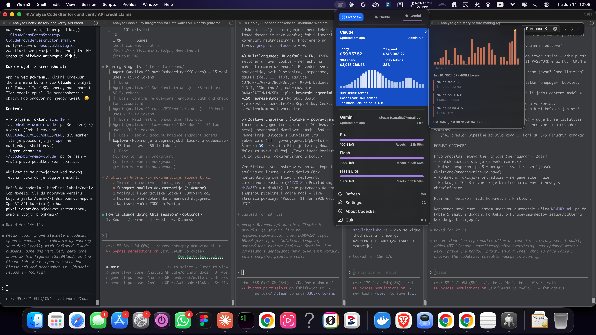
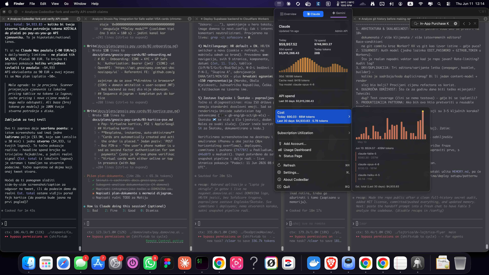
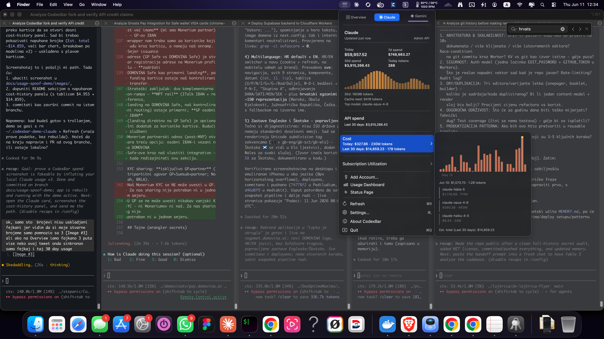
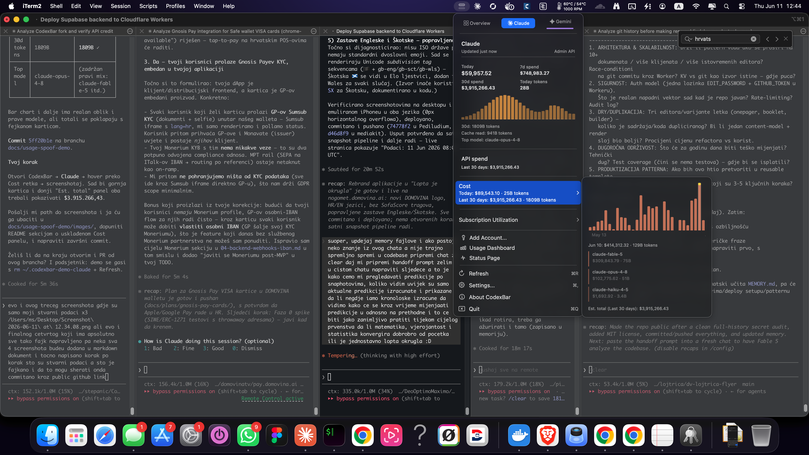

# Koliko (ne)vrijedi screenshot potrošnje — demonstracija

> Kratki ogled o tome zašto je screenshot "potrošnje na AI-u" iz menu-bar
> aplikacije **trivijalno lažirati**, i kako razlikovati lažirano polje od
> stvarnog signala koji se čita s diska.

## Povod

Povod je [ovaj tweet](https://x.com/steipete/status/2055346265869721905) koji
prikazuje CodexBar (macOS menu-bar app, čiji je ovo fork) s impresivnim
brojkama na **OpenAI API** kartici:



| Polje | Iznos sa screenshota |
|---|---|
| Today | $19.985,84 |
| 7d spend | $249.661,09 |
| 30d spend | $1.305.088,81 |
| 30d tokens | 603B |
| 30d requests | 7,6M |

Brojke djeluju nestvarno velike, pa se nameće pitanje: **je li to stvarna
potrošnja, ili marketinški hook?** Cilj ovog dokumenta nije nikoga prozivati —
aplikacija je tehnički odlična — nego pokazati jednu jednostavnu istinu:

> **Brojka na takvom screenshotu nije dokaz ni o čemu. To je samo lokalno
> renderirani UI. Tko kontrolira izvor podataka, kontrolira screenshot.**

Da to dokažemo, ovaj fork dobiva lokalni demo izvor podataka koji prikazuje
**3× veće brojke od originalnog tweeta, i to u Anthropic Claude kreditima** — bez
ijednog stvarnog API ključa.

## Kako podaci teku kroz aplikaciju

CodexBar za svaki provider ima isti tok:

```
fetch strategija  →  UsageSnapshot (obični Double brojevi)  →  SwiftUI kartica
```

Anthropic, OpenAI ni jedan provider ni na koji način ne "potpisuju" te brojke.
Ne postoji provjera autentičnosti. Ako podmetneš vlastiti snapshot, kartica će
pokazati što god mu kažeš. U aplikaciji postoje **dva odvojena podsustava** koja
se oba vide u istom popoveru:

| Podsustav | Što prikazuje | Odakle podaci |
|---|---|---|
| **Provider snapshot** | gornja kartica: Today / 7d / 30d spend, bar chart | fetch strategija (OAuth / Web / Admin API / CLI) |
| **Cost-usage scan** | "Cost" / "API spend" panel: Est. total, breakdown po modelima | lokalni logovi `~/.claude/projects/**/*.jsonl` |

Ova razlika je ključna za priču ispod: jedan podsustav smo potpuno izmislili,
drugi čita stvarne podatke s diska — a u finalu smo i njega "naštimali" da se
poklopi.

## Što je dodano (lokalno, env-gated, reverzibilno)

- `Sources/CodexBarCore/Providers/Claude/ClaudeDemoUsage.swift`
  - `makeSnapshot(multiplier:)` — sintetizira lažni `ClaudeAdminAPIUsageSnapshot`
    (gornja kartica). Baseline = točne brojke s tweeta × multiplikator.
  - `scaledToMatchCard(_:multiplier:)` — skalira **stvarni** cost-usage scan tako
    da mu se 30-dnevni dollar i token totali poklope s lažnom karticom, uz
    očuvanje pravog oblika grafa i pravog popisa modela.
- `ClaudeDemoFetchStrategy` (u `ClaudeProviderDescriptor.swift`) + rana grana u
  `resolveStrategies(...)` — zaobilazi **sve** provjere kredencijala.
- Kuka u `CostUsageFetcher.loadTokenSnapshot(...)` koja skalira cost-usage scan
  kad je demo aktivan i provider je Claude.

Aktivacija (provjerava se kod svakog fetcha):

1. Env varijabla `CODEXBAR_DEMO_CLAUDE_SPEND` (vrijednost = multiplikator), ili
2. Marker datoteka `~/.codexbar-demo-claude` (sadržaj = multiplikator).

Marker datoteka je pouzdaniji put jer se app pokreće preko `open`, koji ne
nasljeđuje shell okolinu.

## Korak po korak: što je stvarno, a što fejk

### Korak 1 — gornja kartica je već lažna, donji panel još stvaran



- 🔴 **FEJK** — Claude kartica (Admin API): `Today $59.957,52`, `7d $748.983,27`,
  `30d $3.915.266,43`, `1809B tokens`, `Top model: claude-opus-4-8`.
  To je `ClaudeDemoUsage.makeSnapshot` — čisto izmišljeno, 3× tweet.
- 🟢 **STVARNO** — Gemini red (`stvarni e-mail`, plan "Paid") i sve ostalo izvan
  Claude kartice.

U ovom trenutku cost-usage panel još nije diran.

### Korak 2 — dokaz da je donji panel stvaran (čita se s diska)



- 🟢 **STVARNO** — `Est. total (Last 30 days): $4.933,83`, dnevni bar chart i
  breakdown po modelima (`claude-fable-5 $392,30`, `claude-opus-4-8 $130,13`,
  `claude-haiku-4-5 $2,14`).
  Ovo dolazi iz `CostUsageScanner` koji skenira `~/.claude/projects/**/*.jsonl`
  (na ovom računalu 400+ session fajlova) i množi tokene s javnim API
  cjenovnikom (`CostUsagePricing.claudeCostUSD`).

**Najjači dokaz** da su gornja kartica i ovaj panel dvije različite stvari:
breakdown pokazuje **`claude-fable-5`** — model koji sintetički generator
**nikad ne proizvodi** (generira samo opus/sonnet/haiku) — i iznos je realnih
~$4,9K, a ne izmišljenih $3,9M.

> Što taj broj znači: `$4.933,83` = koliko bi stvarna lokalna potrošnja tokena
> **koštala da se plaća po pay-as-you-go API cjenovniku**. Korisnik je na **Claude
> Max paušalu (~90 EUR/mj)** i **ne plaća** taj iznos — plaća 90 EUR. Broj
> pokazuje koliku vrijednost izvlači iz paušala (~50× ovaj mjesec).

### Korak 3 — i donji panel je sada lažan, ali nesinkroniziran



- 🔴 **FEJK (nesinkronizirano)** — Cost panel: `Today $327,86`, `Last 30 days:
  $14.859,23 · 17B tokens`.
  Ovo je stvarni scan **pomnožen s 3** (`$4.953 × 3 = $14.859`). Oblik grafa i
  modeli su stvarni, ali totali su lažni.

Problem: gornja kartica i dalje pokazuje `$3.915.266`, a Cost panel `$14.859` —
**ne poklapaju se**. (Razlika spram $4.933 iz koraka 2 je jer su u međuvremenu
logirane nove sesije; stvarni se podaci pomiču, što dodatno dokazuje da je to
živi disk-scan.)

### Korak 4 — sve lažno i sinkronizirano



- 🔴 **FEJK (sinkronizirano)** — sada `scaledToMatchCard` skalira cost-usage scan
  tako da mu se 30-dnevni totali **točno poklope** s karticom:

| | Gornja kartica | Cost panel (30d) |
|---|---|---|
| 30d spend | $3.915.266,43 | **$3.915.266,43** ✓ |
| 30d tokens | 1809B | **1809B** ✓ |

Bar chart i breakdown po modelima ostaju realnog oblika (i dalje vidiš
`claude-fable-5`), ali su magnitude napuhane da se sve uklopi. Sada cijeli
popover izgleda kao da netko troši ~$3,9M mjesečno na Claude API — a sve je
izmišljeno na laptopu u pola sata.

> Napomena: "Today" se između kartice i Cost panela može malo razlikovati jer
> kartica koristi sintetičku dnevnu raspodjelu, a Cost panel zadržava stvarni
> oblik (skaliran). Istaknuti 30-dnevni headline se poklapa točno.

## Zaključak

Sva 4 koraka zajedno pokazuju poantu:

- Headline "spend" brojke u ovakvim aplikacijama su **trivijalno lažabilne** —
  nema potpisa, nema verifikacije, samo lokalni `Double`.
- Jedini izvorno realan signal (`Est. total` iz lokalnih logova) je **skroman**
  ($~5K API-ekvivalenta za 90 EUR paušala) — i njega se, ako se hoće, jednako
  lako napuše.

**Screenshot velike potrošnje, sam za sebe, ne dokazuje ništa.**

## Kako reproducirati / ugasiti

```bash
# Uključi demo (multiplikator 3):
echo 3 > ~/.codexbar-demo-claude
# pa u aplikaciji: Refresh (⌘R)

# Promijeni faktor:
echo 10 > ~/.codexbar-demo-claude    # pa Refresh

# Ugasi demo (vraća prave podatke, bez rebuilda):
rm ~/.codexbar-demo-claude           # pa Refresh
```

Brza provjera kroz CLI (isti `loadTokenSnapshot` koji hrani UI):

```bash
.build/debug/CodexBarCLI cost --provider claude
# DEMO OFF →  Last 30 days: $4.953,08 · 5.7B tokens   (stvarno, s diska)
# DEMO ON  →  Last 30 days: $3.915.266,43 · 1809B tokens  (sinkronizirano s karticom)
```

## Napomena o privatnosti screenshotova

Svi screenshotovi u `images/` su procijenjeni prije objave: ne sadrže API
ključeve, tokene, lozinke ni privatne putanje. Jedini PII je autorov Gmail
(ionako javan u git history). Terminalski sadržaj je u niskoj rezoluciji i
nečitljiv. Sigurni za javnu objavu.
