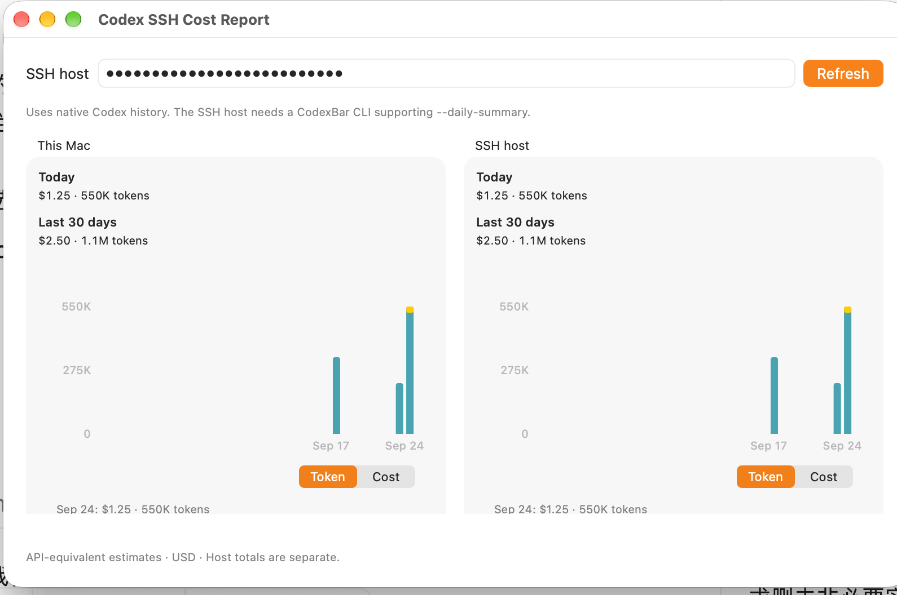
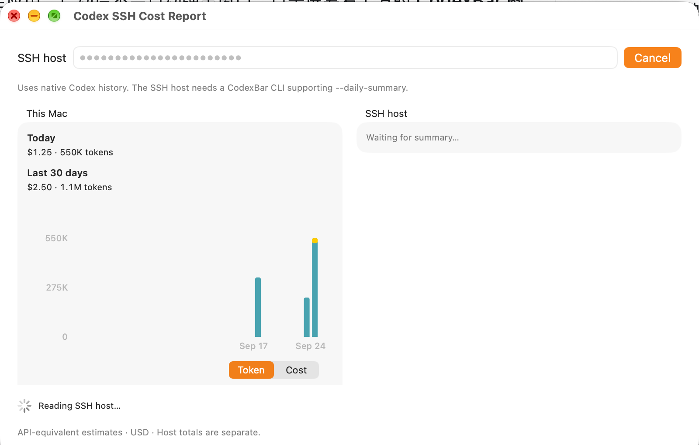
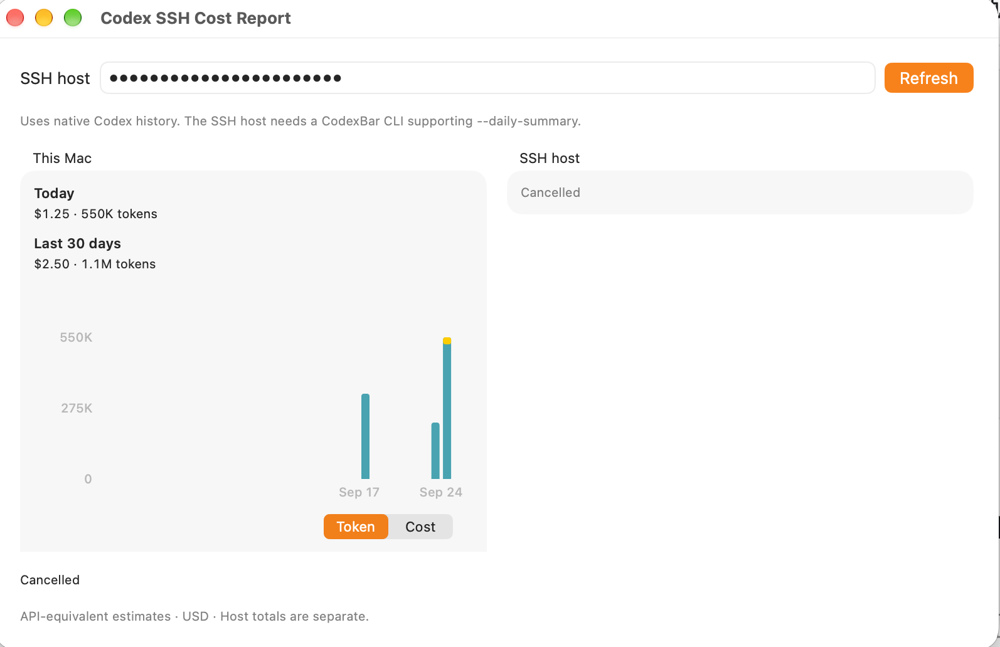

# Manual SSH report: normal-app operation

Source: `9c1f60f0a75cf528a3c8b21efbd43b86c933e493`, macOS, 2026-09-24.
This follow-up addresses the [request for a normally launched app](https://github.com/steipete/CodexBar/pull/3869#issuecomment-5780842520), separately from the earlier programmatic view harness. No production source changed for this run.

## Build and launch

`CODEXBAR_SIGNING=adhoc Scripts/package_app.sh debug` produced the normal `CodexBar.app`; strict deep signature verification passed. A copy used a unique QA app/widget identity and app group, isolated preferences and synthetic Codex history. Its signing metadata, Info.plist environment and identity were adjusted for isolation. After removing signatures, the QA and original app executables were byte-for-byte identical; no entry point was replaced, no query object was injected, and no testing/DYLD environment flag was present in the launched process.

The QA app was launched through LaunchServices. A process sample showed the actual application path:

```text
CodexBar_main
  CodexBarEntryPoint.$main()
    CodexBarEntryPoint.main()  CodexbarApp.swift:38
      SwiftUI App.main()
        NSApplicationMain
          -[NSApplication run]
```

This is a development app running from the worktree, not a replacement for the installed production app. Live account/Keychain access and background providers were disabled through settings; explicit `CODEX_HOME` and Foundation cache/home settings selected synthetic files. The OS preserved the ordinary HOME/SHELL environment; the observed Foundation paths and ZDOTDIR remained directed to the QA area. No claim of an OS sandbox is made.

| Artifact | SHA-256 |
| --- | --- |
| Original packaged app executable | `9fb9b6a4e54f2abcaa69fd7a6c6d2bf591ede545a2064980026ac9998253c726` |
| QA app executable after re-signing | `a9a62620da3f1cad8e17bd25886546f64da750f33b442300ca6ec81164c09ff5` |
| Both executables after removing signatures | `d917165c6d9954d2e3b3d8624f9222d70facb98b6d0237308d64bc37c00913b7` |
| Linux CLI built from the same source commit | `23b70c3e6973f770ff423c14ff410ece060e05b856d06ec517bb115c23641f69` |

## Operator-assisted observations

The desktop-control connection failed when attaching to this app. The operator was given the exact QA bundle in Finder, instructed to open its menu's **SSH Cost Report…**, and confirmed that the report was open. **The menu click is operator-reported, not captured in a recording or independently observed by the automation.** The operator then followed the supplied success and cancellation steps and returned the original screenshots below. They were copied without cropping, compositing, repainting or modifying their content.

| Step | Observation | Evidence boundary |
| --- | --- | --- |
| Open the report from the app menu | Operator confirmed the report was open after the menu-opening instructions. | Operator confirmation; the screenshot sequence does not show the menu gesture. |
| Refresh `codexbar-installed-success` | Both source cards display Today **$1.25 / 550K tokens**, Last 30 days **$2.50 / 1.1M tokens**, and separate daily Token graphs. Host field and remote heading are masked. | Direct success screenshot; values match the independently verified synthetic SSH response. |
| Start `codexbar-installed-slow` | Local data remains visible; remote reads **Waiting for summary…**, status reads **Reading SSH host…**, the input is disabled and the button reads **Cancel**. | Direct in-flight screenshot. |
| Cancel a subsequent slow request | Remote and status read **Cancelled**; the button is **Refresh** again; local values and graph remain. | Direct cancelled-state screenshot following the cancellation instructions; not a continuous recording of the click. |

One intervening screenshot showed a generic remote failure after waiting. It was explicitly **not** counted as successful cancellation. The later screenshot below shows the distinct cancelled state.

### Successful refresh



### Request in progress



### Cancelled state



## SSH fixture and limits

A dedicated Linux container on an Intel Mac ran Swift 6.3.3 and a CLI built from the exact source archive above. Its SSH socket was bound only to the host's loopback port and reached through an existing trusted SSH connection. Dedicated fixture users, keys and synthetic histories were used. The success user used normal sshd command execution; the slow user used a controlled `sleep 40; exit 124` command. A temporary, narrowly scoped local SSH Include enabled the ordinary app's unmodified SSH fetcher.

The independently executed success command returned these Asia/Shanghai buckets:

| Day | API-equivalent USD | Tokens |
| --- | ---: | ---: |
| 2026-09-17 | 0.75 | 330,000 |
| 2026-09-23 | 0.50 | 220,000 |
| 2026-09-24 | 1.25 | 550,000 |
| Total | 2.50 | 1,100,000 |

The screenshots establish the visible success, pending and cancelled states in the normally launched QA app. They do not independently establish exact click timing, continuous menu-to-close behavior, Token/Cost switching in this manual run, or subprocess lifetime. Those remain separate from the earlier automated tests. The viewport also does not show the lower snapshot-time/coverage rows; earlier native captures and tests cover their rendering. Maintainer approval of the window and daily protocol remains a separate decision.
