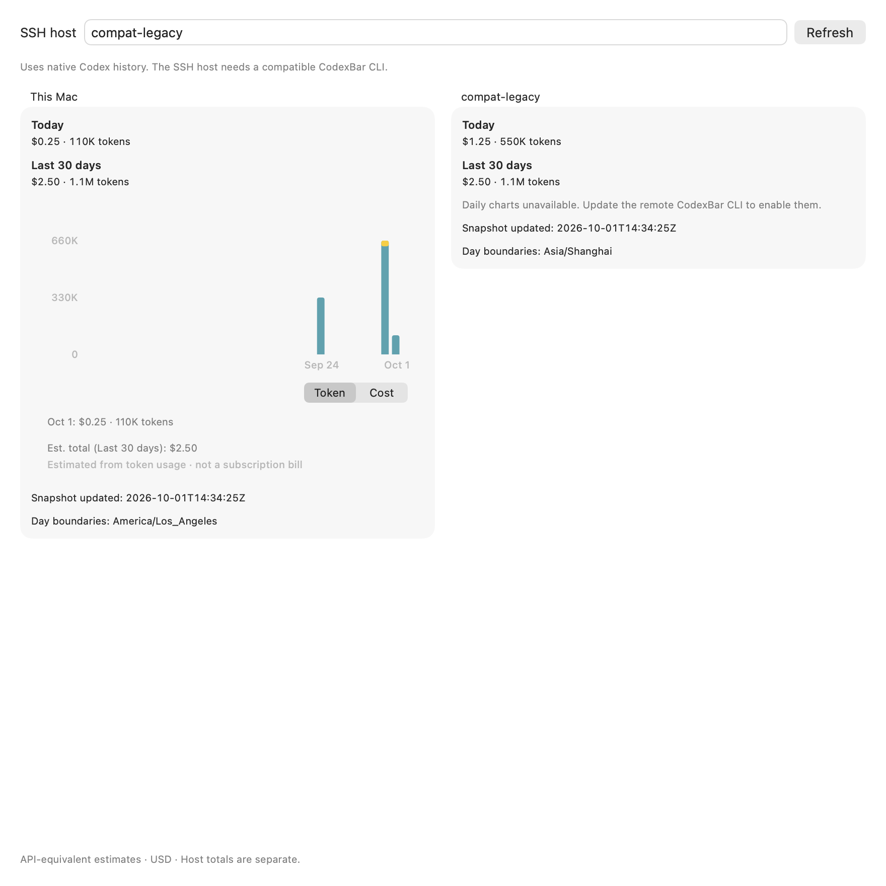
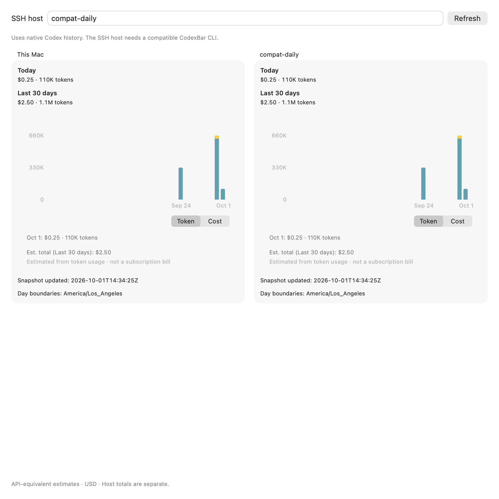

# SSH report compatibility validation

Validated production compatibility code at `13b7c459fe07fbc8ed4d3af452ce49efa6f232d6` using synthetic Codex history and real SSH on the Mac loopback interface. The aggregate-only producer was the official macOS v0.70.0 CLI; the daily-capable producer was the freshly compiled CLI from that candidate. A later commit changes only the Italian notice translation; the CLI executable hash remains unchanged.

The harness calls the production `RemoteCodexCostFetcher.fetchReport` and `CodexSSHCostQuery`. Its injected runner adds a private `-F` SSH configuration and uses a shorter fixture timeout; it retains the production arguments, command selector, output limits and decoder. The SSH server, keys, homes, configuration and caches were task-owned. No production CLI, user SSH configuration or real Codex history was replaced or read.

## Results

Fourteen recorded events passed their checks:

- The aggregate-only CLI returns usable Today/history cost and token totals. Its raw summary matches the published model exactly, including the source timestamp and native `Asia/Shanghai` timezone. There is no remote daily chart.
- The daily-capable CLI returns the full chart history in the requested `America/Los_Angeles` timezone. Each day’s amount and token count matches the independent synthetic fixture.
- Known zero remains zero; unknown prices remain unavailable with unpriced coverage and known token counts.
- Malformed daily output, a failed daily scan, and a daily-advertising wrapper returning a real aggregate report are rejected without a second scan. Failure-injection wrappers are test fixtures, not claims about official CLI defects.
- Unsupported or failed capability output triggers no report scan. Successful selections execute one help request and one report scan.
- Cancellation retains the local result and prevents remote publication during a ten-second observation after the query drains.

An unreadable-file fixture did not produce an actual partial report on this CLI. Partial-state rendering and validation remain covered by unit tests; real partial-scan behavior is not claimed by this run.

## Native view evidence

These images render the actual production view using reports already obtained by the SSH run. They are supplemental harness captures, not a newly recorded normally launched app/menu-opening flow. The earlier normal-app evidence remains separately pinned in [ssh-cost-app.md](ssh-cost-app.md).

## Boundaries

This run used Mac loopback SSH, not the xiemac Linux container. Both JSON formats remain unchanged; the fixed SSH mode marker binds the receiver to the command selected before scanning. No arbitrary scanner failure is treated as old-protocol support. The dedicated native window and daily protocol still require the maintainer’s scope decision.

Cleanup was verified: the task-owned SSH server/listener and private credentials were removed; the user SSH config and known_hosts remain byte-identical. The task did not alter system Remote Login, global VPN state, production CLI/App installations or xiemac services.
